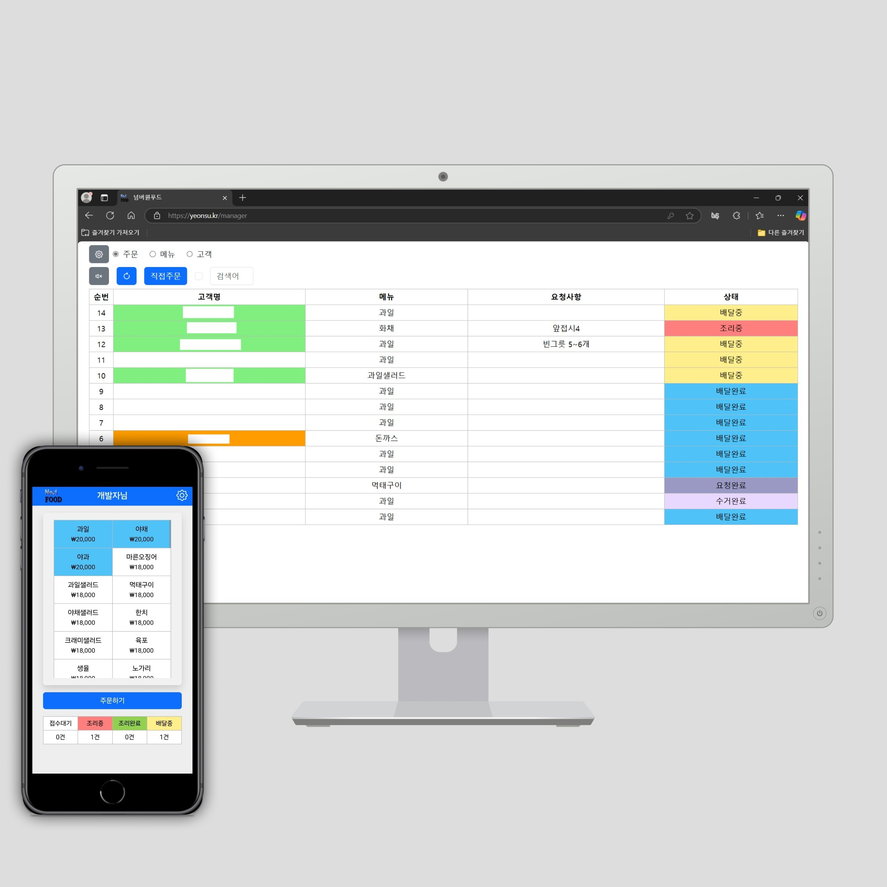
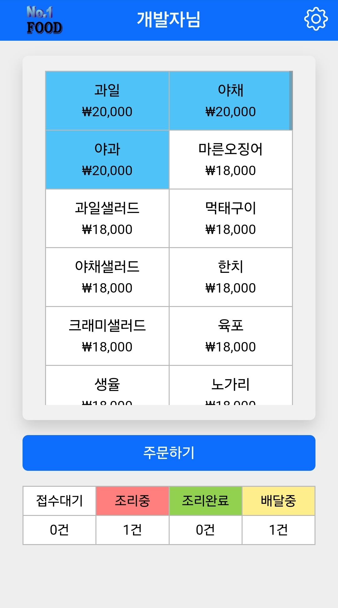
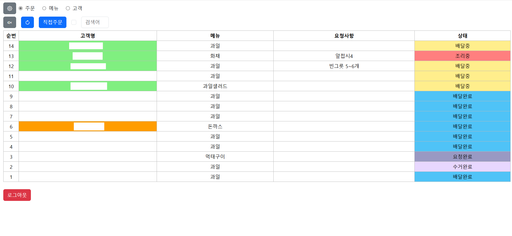
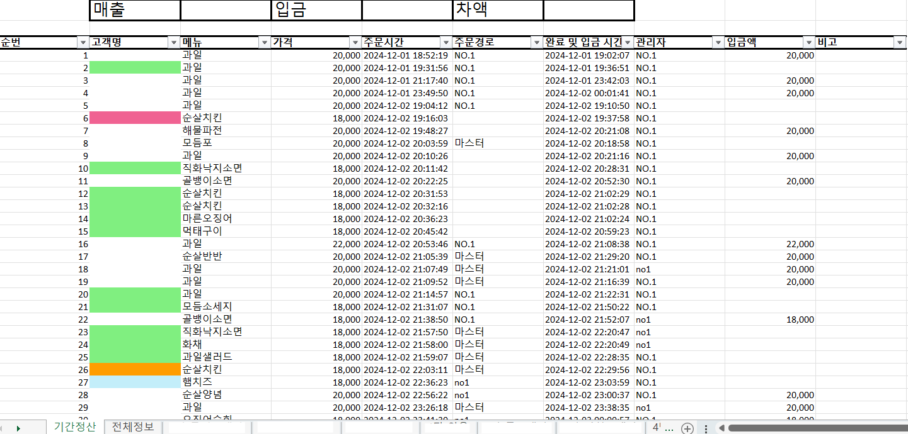

# No1Food - 배달 및 주문 관리 통합 시스템 🍔
> **효율적인 매장 운영과 고객 관리를 위한 실시간 B2B/B2C 솔루션**

## 📸 화면 데모 (Visual Demonstration)
|  |  |  |  |
|:-------------------------:|:-------------------------:|:-------------------------:|:-------------------------:|
| 1. 전체적인 화면 | 2. 고객 주문 웹 서비스 | 3. 주문 상태 변경 알림 | 4. 엑셀 기반 정산 기능 |

## 💡 개발 동기 및 해결 과제 (Motivation & Problem)
식음료 매장을 운영할 때 발생하는 복잡한 주문 처리, 고객 포인트 관리, 영업 시간 설정 등의 반복적이고 소모적인 운영 리소스를 최소화하기 위해 개발되었습니다. 
이 프로젝트를 통해 **실시간 양방향 통신(WebSocket)을 이용한 즉각적인 주문 상태 동기화**와 **역할 기반(고객 vs 관리자)의 안전한 인가(Authorization) 인프라**를 구축하는 방법을 깊이 있게 학습하고 해결하고자 했습니다.

<br/>

## 🛠 기술 스택 및 도입 배경 (Tech Stack & Rationale)
- **Node.js & NestJS**: 체계적인 모듈 아키텍처와 DI(의존성 주입)를 제공하여, 복잡해지는 비즈니스 로직(주문, 결제, 알림 등)의 유지보수성과 확장성을 높이기 위해 선택했습니다.
- **TypeScript**: 정적 타입 지원으로 런타임 에러를 사전에 방지하고 엔티티 모델링의 안정성을 확보하기 위해 사용했습니다.
- **MySQL & TypeORM**: 주문 내역, 포인트 증감 등 데이터 무결성이 중요한 비즈니스 로직을 처리하고 관계형 데이터를 효율적으로 다루기 위해 채택했습니다.
- **Socket.io**: 고객이 접수한 주문이 관리자에게 새로고침 없이 실시간으로 전달되게 구현하기 위해 도입했습니다.
- **Firebase Cloud Messaging (FCM)**: 기기별 푸시 알림을 통해 고객에게 주문 상태 변경(조리 시작, 배달 출발 등)을 즉각적으로 알리기 위해 사용했습니다.
- **JWT (JSON Web Token)**: 서버의 세션 저장소 부하를 줄이고, 확장성 있는 Stateless 사용자 인증 체계를 구축하기 위해 활용했습니다.

<br/>

## ✨ 주요 기능 (Key Features)
- **실시간 주문 파이프라인**: Socket 통신을 활용한 실시간 주문 생성 및 상태 추적(대기 ➔ 조리중 ➔ 완료)
- **역할 기반 접근 제어 (RBAC)**: 고객(`client`)과 관리자(`manager`)의 권한 범위를 완벽히 분리하고 전용 API 제공
- **고객 및 크레딧/포인트 관리**: 사용자의 과거 주문 내역 바탕의 등급 관리 및 결제에 사용 가능한 포인트/크레딧 시스템
- **동적 메뉴 및 카테고리 제어**: 유동적인 메뉴 구성, 카테고리 분류, 품절/블라인드 처리 기능
- **고급 운영 설정 및 스케줄링**: `cron` 기반의 주기적인 알림 발송 및 관리자 페이지를 통한 유연한 매장 영업 시간 설정
- **데이터 추출 (엑셀 Export)**: 주문 이력 및 고객 데이터를 쉽게 분석할 수 있도록 XLSX 파일 다운로드 지원

<br/>

## 🚀 시작하기 (Getting Started Guide)
아래의 단계에 따라 로컬 환경에서 서버를 구동할 수 있습니다.

### 1. 저장소 클론 및 디렉토리 이동
```bash
git clone https://github.com/your-username/no1food-back.git
cd no1food-back
```

### 2. 패키지 설치
```bash
npm install
```

### 3. 환경 변수 및 인증 키 설정
미리 발급받은 Firebase 서비스 어카운트 키 인증 파일(firebase-cert.json)을 루트 디렉토리에 위치시킵니다.
그 후 루트 디렉토리에 `.env` 파일을 생성하고 아래와 같이 데이터베이스 및 JWT 정보를 기입합니다.
```env
DB_HOST=localhost
DB_PORT=3306
DB_USER=root
DB_PASSWORD=your_password

DB_NAME=no1food
JWT_SECRET=super_secret_jwt_key
```

### 4. 로컬 데이터베이스 연동 및 서버 실행
```bash
# 개발 모드로 서버 실행 (코드 변경 시 자동 재시작)
npm run start:dev
```

### 5. 접속 테스트
서버가 정상적으로 구동되면 브라우저에서 아래 주소로 접속해 서비스가 동작하는지 확인합니다. (정적 파일 서버 연동)
```text
http://localhost:3000
```
